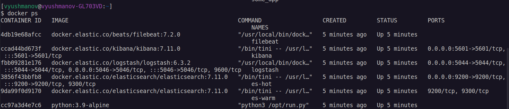
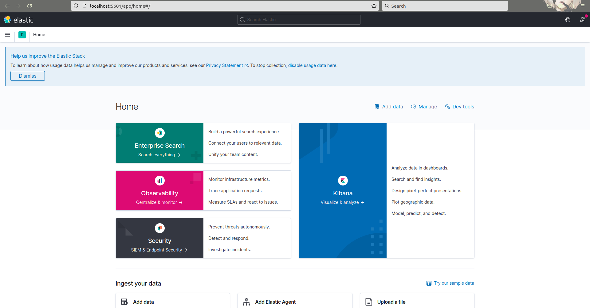

# Домашнее задание к занятию 15 «Система сбора логов Elastic Stack»

## Задание 1

Вам необходимо поднять в докере и связать между собой:

- elasticsearch (hot и warm ноды);
- logstash;
- kibana;
- filebeat.

Logstash следует сконфигурировать для приёма по tcp json-сообщений.
Filebeat следует сконфигурировать для отправки логов docker вашей системы в logstash.

Результатом выполнения задания должны быть:

- скриншот `docker ps` через 5 минут после старта всех контейнеров (их должно быть 5);
- скриншот интерфейса kibana;

### Ответ

При выполнении задания, в основном, использовались файлы из вспомогатльной директории, однако пришлось внести в них несколько исправлений:
- В файле [docker-compose](./docker-compose.yml) был исправлен volume (т.к. при запуске а контейнере конфиг вычитывается из `/opt/logstash/config/logstash.yml`), а также он был помещён в сеть elastic наряду с остальными контейнерами (без этого DNS не работал и контейнер был недостижим filebeat'ом)
- В файле [filebeat.yml](./configs/filebeat.yml) в output был добавлен `protocol: tcp`, т.к. без этого параметра происходили проблемы с кодировкой
- Также был исправлен [logstash.conf](./configs/logstash.conf) - фильтр был дополнен, т.к. он не может работать без заданного параметра `source`.

1. Скриншот списка процессов docker:

2. Главный экран:

## Задание 2

Перейдите в меню [создания index-patterns  в kibana](http://localhost:5601/app/management/kibana/indexPatterns/create) и создайте несколько index-patterns из имеющихся.

Перейдите в меню просмотра логов в kibana (Discover) и самостоятельно изучите, как отображаются логи и как производить поиск по логам.

В манифесте директории help также приведенно dummy-приложение, которое генерирует рандомные события в stdout-контейнера.
Эти логи должны порождать индекс logstash-* в elasticsearch. Если этого индекса нет — воспользуйтесь советами и источниками из раздела «Дополнительные ссылки» этого задания.
 
### Ответ

1. Список созданных индекс-паттернов:

2. Отфильтрованные по имени контейнера сообщения, отображается только поле message:

