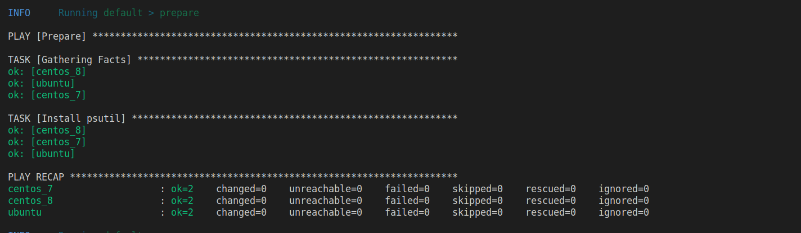
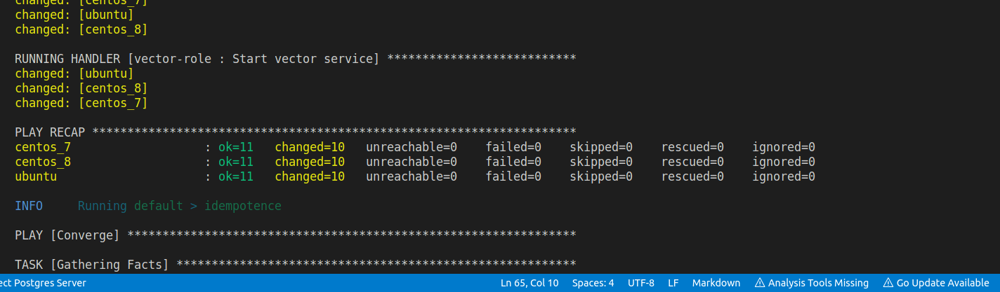
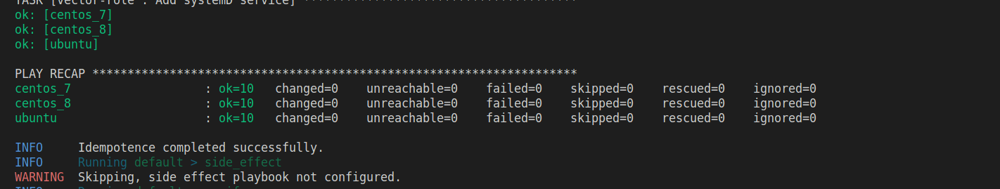
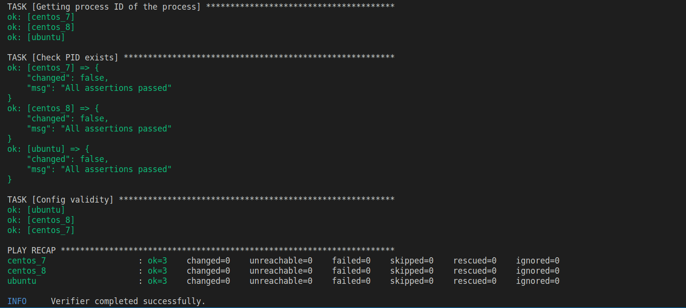
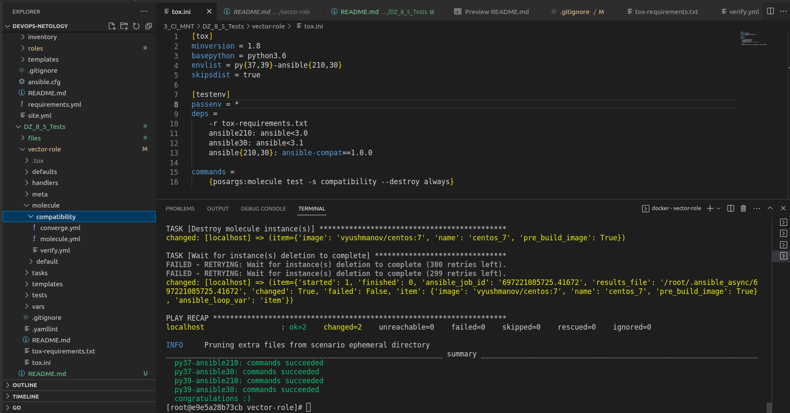

# ДЗ 8.5

## Molecule

### Коммит `vector-role` версии [1.1.0](https://github.com/vvyushmanov/vector-role/releases/tag/1.1.0)

1. Основной конфиг теста `default` `molecule.yaml` выглядит так:

```yaml
---
dependency:
  name: galaxy
driver:
  name: docker
lint: |
  yamllint .
  ansible-lint .
platforms:
- name: centos_7
  image: vyushmanov/centos:7
- name: ubuntu
  image: vyushmanov/ubuntu:latest
- name: centos_8
  image: vyushmanov/centos:8
provisioner:
  name: ansible
  options:
    vv: true
    D: true
verifier:
  name: ansible
```

- Роль проверяется на centos 7/8 и на ubuntu
- Выполняется проверка синтаксиса
- К сожалению, несмотря на все усилия, запустить контейнеры с функциональным `systemd` на моей Ubuntu 22.04 на ноутбуке не удалось (не помог запуск в priviledged режиме, монтирование необходимых системных разделов, запуск конейнера с /usr/bin/init в качестве PID 1 и т.д.). В связи с этим, образы были собраны с [docker-systemctl-replacement](https://github.com/gdraheim/docker-systemctl-replacement) на борту на базе образов `pycontribs`. Образы доступны в docker hub.
- От динамической сборки образов пришлось отказаться, так как `molecule` не поддерживает Docker Context, из-за чего не удавалось выполнить `COPY` в сборке на основе `Dokerfile.j2`

2. Дополнительные проверки реализованы в файле `verify.yaml`:

```yaml
---
- name: Verify
  hosts: all
  gather_facts: false
  tasks:
  - name: Getting process ID of the process
    community.general.pids:
      name: vector
    register: vector_pid
  - name: Check PID exists
    ansible.builtin.assert:
      that: vector_pid.pids[0] is defined
  - name: Config validity
    ansible.builtin.command:
      vector validate /etc/vector/vector.toml
    register: validate
    failed_when: validate.rc != 0
    changed_when: false
```

- Получение PID процесса и запись результата в переменную (требуется модуль `psutil`, что прописано в `prepare.yml`)
- Проверка, что PID ненулевой, следовательно, процесс запущен
- Валидация конфига: выполнение команды валидации и проверка на нулевой код выхода

3. Результаты некоторых этапов теста:
    - Prepare:
    
    - Converge:
    
    - Idempotence
    
    - Verifier
    

## Tox

### Коммит `vector-role` версии [1.1.1](https://github.com/vvyushmanov/vector-role/releases/tag/1.1.1)

Основной дебаг `Tox` пришёлся на модуль `molecule-podman`, для которого в средах `py39` фейлились sanity checks модуля и тест постоянно падал. При этом, в `py37` всё работало исправно.</br>

После различных прогонов, чтения документации и исходного кода драйвера и модулей, было выявлено:

1. Драйвер `molecule-podman` имеет зависимость `ansible-compat>=0.5.0`, модуля выявления совместимости, не входящего в основной пакет Ansible
2. Текущая версия `ansible-compat` (3.0.1) совместима с ansible >= 2.12 (4.0), т.к. опирается на вывод `ansible --version`, формат которого сменился начиная с версии 2.12 (добавилась приписка core или base)
3. С версиями ansible<4.0 совместим `ansible-compat` 1.0.0
4. Драйвер `molecule-podman` совместим с `ansible` 2.10+, о чём говорит блок кода sanity checks, который, в свою очередь, опирается на `ansible-compat`
5. Команда `pip install ansible-compat` на `py39` устанавливает версию `3.0.1`, тогда как на `py37` устанавливается версия `1.0.0` (вероятно    , последняя совместимая с этой версией python)

Таким образом, в результате некоректной реализации sanity check и зависимостей, при попытке запустить `molecule-podman` под `ansible{2.10,3.0}` на `py39` c параметрами по умолчанию, несовместимые модули "ломают" проверку, что приводит к ошибкам.

В качестве решения, для сред `ansible210` и `ansible30` в tox была указана зависимость `ansible-compat==1.0.0`:

```ini
[testenv]
passenv = *
deps =
    -r tox-requirements.txt 
    ansible210: ansible<3.0 
    ansible30: ansible<3.1 
    ansible{210,30}: ansible-compat==1.0.0
```

Успешное прохождение всех тестов:
