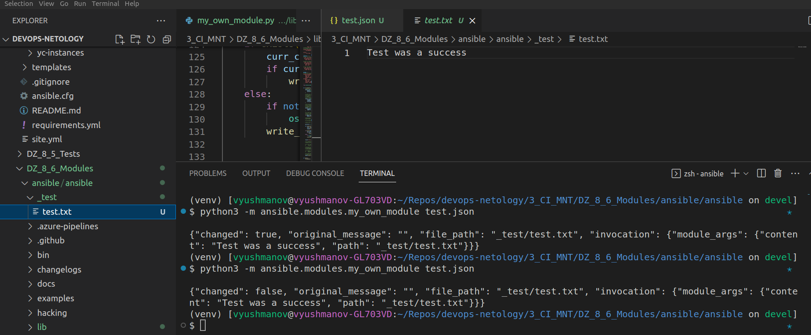
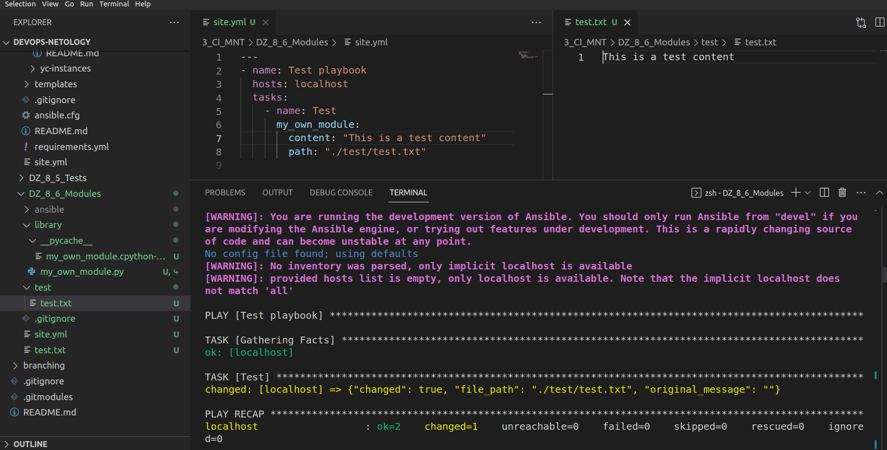
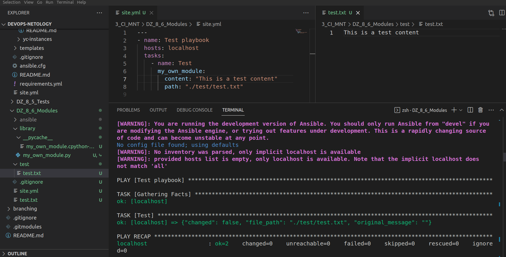
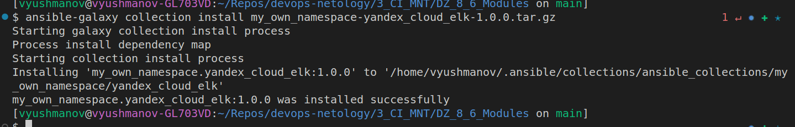
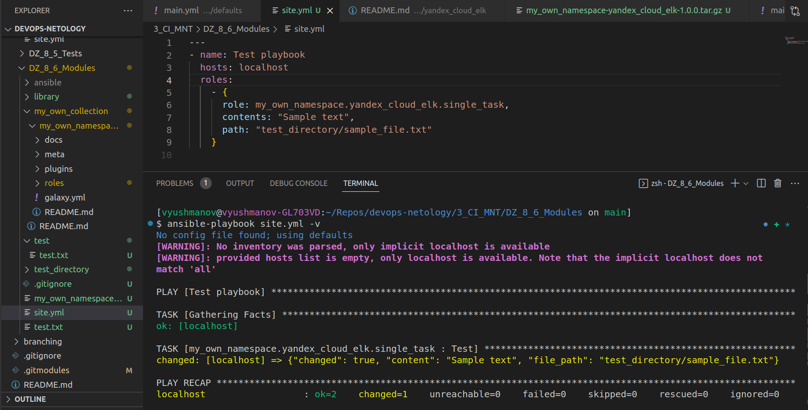
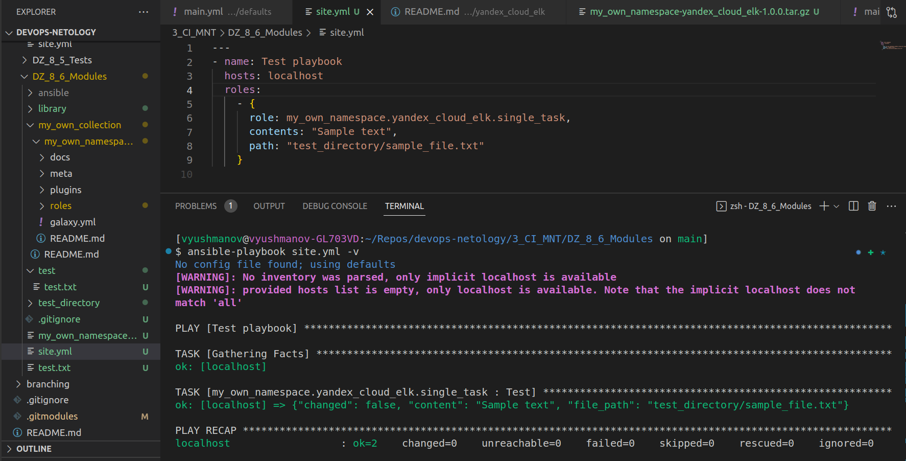

# Домашнее задание к занятию 6 «Создание собственных модулей»

[Текст ДЗ](https://github.com/netology-code/mnt-homeworks/tree/MNT-video/08-ansible-06-module)

## Репозиторий с коллекцией

https://github.com/vvyushmanov/my_own_collection

## Файл-архив с коллекцией

[Перейти по ссылке](./my_own_namespace-yandex_cloud_elk-1.0.0.tar.gz)

## Шаги выполнения

* Шаг 4. Проверьте module на исполняемость локально.

* Шаг 6. Проверьте через playbook на идемпотентность.

Шаг 15. Установите collection из локального архива: ansible-galaxy collection install <archivename>.tar.gz.

Шаг 16. Запустите playbook, убедитесь, что он работает.

