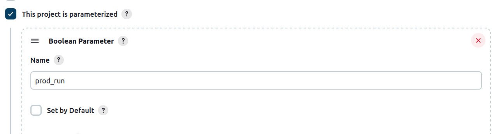

# Домашнее задание к занятию 10 «Jenkins»

Отправить ссылку на репозиторий с ролью и Declarative Pipeline и Scripted Pipeline.

### 1. Ссылка на репозиторий с ролью (файлы лежат в корне репозитория):

https://github.com/vvyushmanov/vector-role

### 2. Declarative Pipeline

Примечание:
Поскольку для выполнения ДЗ были развёрнуты ноды на Centos 7, версия Python, доступная через менеджер пакетов: 3.6, а также в силу того, что созданная ранее роль требует Python 3.7+, были произведены следующие дополнения ноды Agent:

1. Установлен Python 3.9, доступный в `/usr/bin/python3.9/`
2. Установлен модуль `selinux` для данной версии: `python3.9 -m pip install selinux`

Для ускорения процесса, данные манипуляции были совершены через командную строку, однако есть четкое представление о том, как это можно было бы реализовать в качестве дополнительных тасок плейбука (что не было сделано для экономии времени, т.к. не являлось частью задания).

Также для Jenkins был установлен плагин `Pyenv`, позволяющий создавать вирутальное окружение и выполнять команды внутри него. Таким образом, molecule запускался в виртуальном окружении на базе Python 3.9.

```groovy
pipeline {
    agent any
    stages {
        stage('Prepare') {
            steps {
                dir('vector-role') {
                    git branch: 'main', url: 'https://github.com/vvyushmanov/vector-role'
                }
            }    
        }
        stage('Run tests') {
            steps{
                withPythonEnv('/usr/bin/python3.9') {
                    sh 'python3 --version'
                    sh 'pip install -r molecule/venv/requirements.txt'
                    sh 'molecule test'
                    
                }
            }
        }        
    }
}
```

### 3. Scripted Pipeline

Для параметрического запуска данной джобы был использован флаг `This project is parametrized`:



```groovy
node("linux"){
    stage("Git checkout"){
        git url: 'https://github.com/aragastmatb/example-playbook.git'
    }
    stage("Run playbook"){
        if (params.prod_run == true){
            sh 'ansible-playbook site.yml -i inventory/prod.yml'
        }
        else{
            sh 'ansible-playbook site.yml -i inventory/prod.yml --check --diff'
        }
        
    }
}
```
