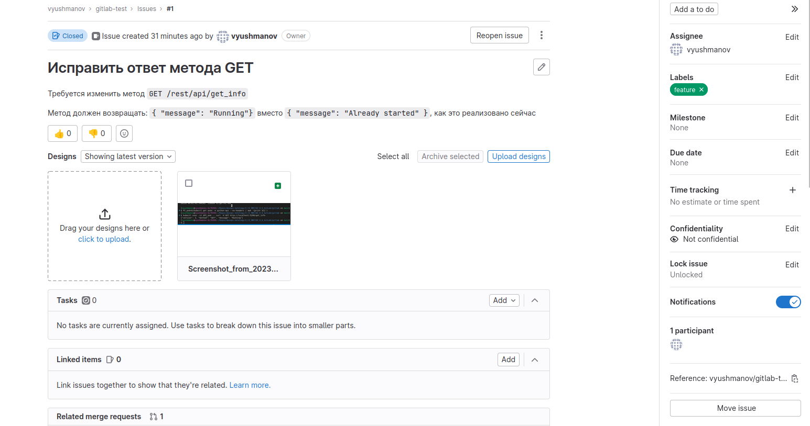

# Домашнее задание к занятию 12 «GitLab»

## Итог

В качестве ответа пришлите подробные скриншоты по каждому пункту задания:

1. Файл gitlab-ci.yml;


Полный файл можно посмотреть [здесь](./gitlab-ci.yml)

2. Dockerfile; 


Полный файл можно посмотреть [здесь](./dockerfile)

3. Лог успешного выполнения пайплайна;

Build:


--> [Лог целиком](./build.log) <--

Deploy:


--> [Лог целиком](./deploy.log) <--

4. Решённый Issue

- Создание


- Merge request


- Merged


- Тест


- Закрытый issue



## Дополнительное задание

Для того, чтобы протестировать успешный запуск контейнера и отображение ожидаемого сообщения, файл `gitlab-ci.yml` необходимо дополнить следующим образом:

``` yml
stages:
  - build
  - deploy
  - test

# ...
# build and deploy stages.......
# ...

test:
  image: gcr.io/cloud-builders/kubectl:latest
  stage: test
  script:
    - kubectl config set-cluster k8s --server="$KUBE_URL" --insecure-skip-tls-verify=true
    - kubectl config set-credentials admin --token="$KUBE_TOKEN"
    - kubectl config set-context default --cluster=k8s --user=admin
    - kubectl config use-context default
    - sed -i "s/__VERSION__/latest/" k8s.yaml
    - kubectl apply -f k8s.yaml
    - IP=$(kubectl get pod -n python-api --selector=app=python-api --output=jsonpath='{.items[0].status.podIP}')
    - response=$(curl -X GET http://$IP:5290/get_info)
    - echo $response
    - echo $response | grep "Running" || exit 1
  only:
    - main
```
