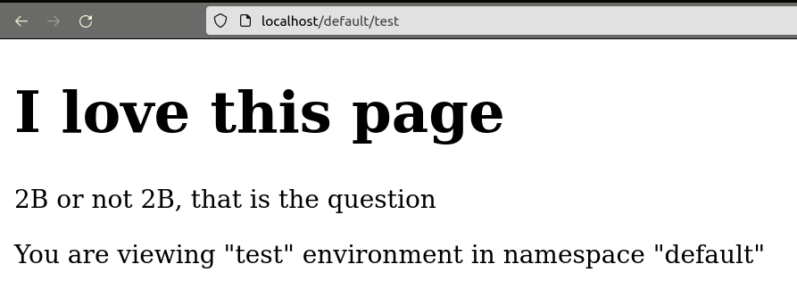
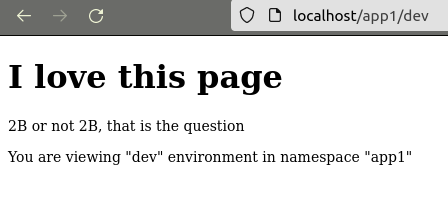

# Домашнее задание к занятию «Helm»

### Цель задания

В тестовой среде Kubernetes необходимо установить и обновить приложения с помощью Helm.

------

### Ответы

Чарт находится [здесь](./nginx/)

### Задание 1. Подготовить Helm-чарт для приложения

1. Необходимо упаковать приложение в чарт для деплоя в разные окружения. 
2. Каждый компонент приложения деплоится отдельным deployment’ом или statefulset’ом.
3. В переменных чарта измените образ приложения для изменения версии.

```shell
[vyushmanov@vyushmanov-GL703VD:~/Repos/devops-netology/5_K8S/5.10. Helm on main]
$ helm install test ./nginx --set appVersion="1.16"                                                              
NAME: test
LAST DEPLOYED: Thu Jul 27 02:41:06 2023
NAMESPACE: default
STATUS: deployed
REVISION: 1
TEST SUITE: None
NOTES:
nginx:1.16 has been deployed in /default/test
[vyushmanov@vyushmanov-GL703VD:~/Repos/devops-netology/5_K8S/5.10. Helm on main]
$ kubectl describe pod/nginx-test-7c8b98c8fb-8lnl7 | grep Image              
    Image:          nginx:1.16
    Image ID:       docker.io/library/nginx@sha256:d20aa6d1cae56fd17cd458f4807e0de462caf2336f0b70b5eeb69fcaaf30dd9c
```



### Задание 2. Запустить две версии в разных неймспейсах

1. Подготовив чарт, необходимо его проверить. Запуститe несколько копий приложения.
2. Одну версию в namespace=app1, вторую версию в том же неймспейсе, третью версию в namespace=app2.
3. Продемонстрируйте результат.

```shell
[vyushmanov@vyushmanov-GL703VD:~/Repos/devops-netology/5_K8S/5.10. Helm on main]
$ helm install -n app1 test ./nginx --set appVersion="1.16"                          
NAME: test
LAST DEPLOYED: Thu Jul 27 02:50:57 2023
NAMESPACE: app1
STATUS: deployed
REVISION: 1
TEST SUITE: None
NOTES:
nginx:1.16 has been deployed in /app1/test
[vyushmanov@vyushmanov-GL703VD:~/Repos/devops-netology/5_K8S/5.10. Helm on main]
$ helm install -n app1 dev ./nginx                                                   
NAME: dev
LAST DEPLOYED: Thu Jul 27 02:51:11 2023
NAMESPACE: app1
STATUS: deployed
REVISION: 1
TEST SUITE: None
NOTES:
nginx:1.21.0 has been deployed in /app1/dev
[vyushmanov@vyushmanov-GL703VD:~/Repos/devops-netology/5_K8S/5.10. Helm on main]
$ helm install -n app2 test ./nginx                                                  
NAME: test
LAST DEPLOYED: Thu Jul 27 02:51:23 2023
NAMESPACE: app2
STATUS: deployed
REVISION: 1
TEST SUITE: None
NOTES:
nginx:1.21.0 has been deployed in /app2/test
```

```shell
[vyushmanov@vyushmanov-GL703VD:~/Repos/devops-netology/5_K8S/5.10. Helm on main]
$ helm list -A                                                                       
NAME    NAMESPACE       REVISION        UPDATED                                 STATUS          CHART           APP VERSION
dev     app1            1               2023-07-27 02:51:11.265169424 +0400 +04 deployed        nginx-0.1.1     1.21.0     
test    default         1               2023-07-27 02:41:06.303689653 +0400 +04 deployed        nginx-0.1.1     1.21.0     
test    app1            1               2023-07-27 02:50:57.676366731 +0400 +04 deployed        nginx-0.1.1     1.21.0     
test    app2            1               2023-07-27 02:51:23.535436524 +0400 +04 deployed        nginx-0.1.1     1.21.0
[vyushmanov@vyushmanov-GL703VD:~/Repos/devops-netology/5_K8S/5.10. Helm on main]
$ kubectl describe -n app2 pod/nginx-test-548b8f5848-lcrp5 | grep Image      
    Image:          nginx:1.21.0
```




