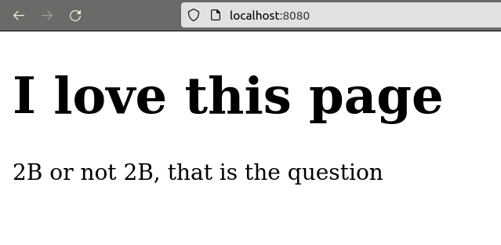
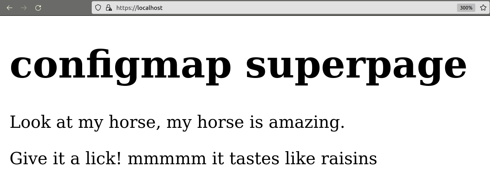

# Домашнее задание к занятию «Конфигурация приложений»

### Цель задания

В тестовой среде Kubernetes необходимо создать конфигурацию и продемонстрировать работу приложения.

------

### Задание 1. Создать Deployment приложения и решить возникшую проблему с помощью ConfigMap. Добавить веб-страницу

1. Создать Deployment приложения, состоящего из контейнеров busybox и multitool.
2. Решить возникшую проблему с помощью ConfigMap.
3. Продемонстрировать, что pod стартовал и оба конейнера работают.
4. Сделать простую веб-страницу и подключить её к Nginx с помощью ConfigMap. Подключить Service и показать вывод curl или в браузере.
5. Предоставить манифесты, а также скриншоты или вывод необходимых команд.

### Ответ

1. ConfigMap for env vars

[Multitool + Busybox deployment](task1/mt_bb.yml)

[Env var configmap](task1/env.yaml)

```shell
[vyushmanov@vyushmanov-GL703VD:~/Repos/devops-netology/5_K8S/5.8. App configuration/task1 on main]
$ kubectl get pods                                                                                                 ✭
NAME                     READY   STATUS    RESTARTS   AGE
mt-bb-69886ffb47-rrdj6   2/2     Running   0          3m25s
...
[vyushmanov@vyushmanov-GL703VD:~/Repos/devops-netology/5_K8S/5.8. App configuration/task1 on main]
$ kubectl exec -t mt-bb-69886ffb47-rrdj6 -c multitool -- curl localhost:8080                                   7 ↵ ✭
WBITT Network MultiTool (with NGINX) - mt-bb-69886ffb47-rrdj6 - 10.1.125.253 - HTTP: 8080 , HTTPS: 443 . (Formerly praqma/network-multitool)
```

2. Nginx web page via ConfigMap

[Nginx deployment+service](task1/nginx-k8s.yaml)

[Weppage CM](task1/webpage-cm.yaml)

```shell
[vyushmanov@vyushmanov-GL703VD:~/Repos/devops-netology/5_K8S/5.8. App configuration/task1 on main]
$ kubectl apply -f .               
deployment.apps/nginx-k8s created
service/nginx-k8s created
configmap/webpage-cm created
[vyushmanov@vyushmanov-GL703VD:~/Repos/devops-netology/5_K8S/5.8. App configuration/task1 on main]
$ kubectl port-forward svc/nginx-k8s 8080:80                  
Forwarding from 127.0.0.1:8080 -> 80
Forwarding from [::1]:8080 -> 80
Handling connection for 8080
```



------

### Задание 2. Создать приложение с вашей веб-страницей, доступной по HTTPS

1. Создать Deployment приложения, состоящего из Nginx.
2. Создать собственную веб-страницу и подключить её как ConfigMap к приложению.
3. Выпустить самоподписной сертификат SSL. Создать Secret для использования сертификата.
4. Создать Ingress и необходимый Service, подключить к нему SSL в вид. Продемонстировать доступ к приложению по HTTPS.
5. Предоставить манифесты, а также скриншоты или вывод необходимых команд.

### Ответ

[Deployment + Service](task2/nginx-k8s.yaml)

[Webpage ConfigMap](task2/webpage-cm.yaml)

[Ingress](task2/ingress-nginx.yaml)

[Certificates Secret](task2/certificates.yaml)

```shell
[vyushmanov@vyushmanov-GL703VD:~/Repos/devops-netology/5_K8S/5.8. App configuration/task2 on main]
$ kubectl apply -f .                                            
secret/nginx-tls created
ingress.networking.k8s.io/ingress-nginx created
deployment.apps/nginx-k8s created
service/nginx-k8s created
configmap/webpage-cm created
[vyushmanov@vyushmanov-GL703VD:~/Repos/devops-netology/5_K8S/5.8. App configuration/task2 on main]
$ curl -k "https://localhost:443"                               
<!DOCTYPE html>
<html>
<head>
<title>
k8s configmap testing</title>
<meta name="viewport" content="width=device-width, initial-scale=1">
<style>
body {background-color:#ffffff;background-repeat:no-repeat;background-position:top left;background-attachment:fixed;}
h1{font-family:Georgia, serif;color:#000000;background-color:#ffffff;}
p {font-family:Georgia, serif;font-size:14px;font-style:normal;font-weight:normal;color:#000000;background-color:#ffffff;}
</style>
</head>
<body>
<h1>configmap superpage</h1>
<p>Look at my horse, my horse is amazing.</p>
<p>Give it a lick! mmmmm it tastes like raisins</p>
</body>
</html>
```




