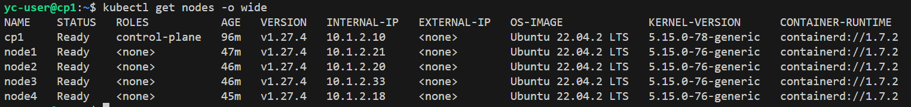
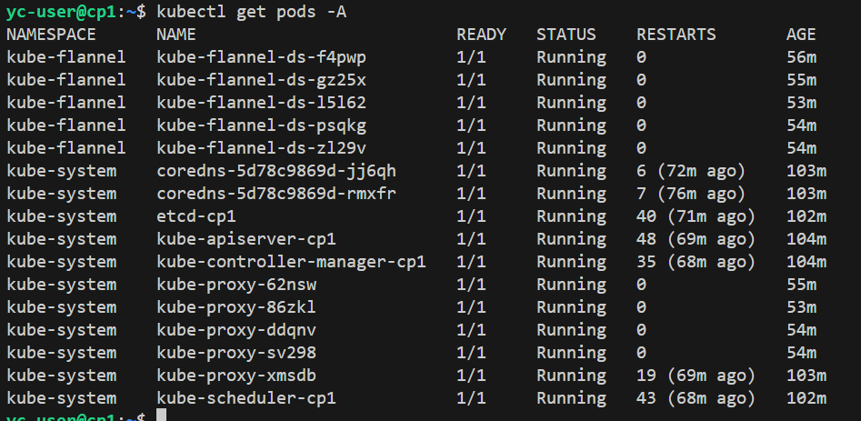

# Домашнее задание к занятию «Установка Kubernetes»

### Цель задания

Установить кластер K8s.

### Инструменты и дополнительные материалы, которые пригодятся для выполнения задания

1. [Инструкция по установке kubeadm](https://kubernetes.io/docs/setup/production-environment/tools/kubeadm/create-cluster-kubeadm/).
2. [Документация kubespray](https://kubespray.io/).

-----

### Задание 1. Установить кластер k8s с 1 master node

1. Подготовка работы кластера из 5 нод: 1 мастер и 4 рабочие ноды.
2. В качестве CRI — containerd.
3. Запуск etcd производить на мастере.
4. Способ установки выбрать самостоятельно.

#### Создание вирутальных машин

```shell
#!/bin/bash

set -e

function create_vm {
  local NAME=$1

  YC=$(cat <<END
    yc compute instance create \
      --name $NAME \
      --hostname $NAME \
      --zone ru-central1-a \
      --network-interface subnet-name=base_subnet,nat-ip-version=ipv4 \
      --memory 4 \
      --cores 2 \
      --create-boot-disk image-folder-id=standard-images,image-family=ubuntu-2204-lts,type=network-ssd,size=20 \
      --ssh-key $HOME/.ssh/id_rsa.pub
END
)
#  echo "$YC"
  eval "$YC"
}

create_vm "cp1"
create_vm "node1"
create_vm "node2"
create_vm "node3"
create_vm "node4"
```

```shell
+----------------------+-------+---------------+---------+-----------------+-------------+
|          ID          | NAME  |    ZONE ID    | STATUS  |   EXTERNAL IP   | INTERNAL IP |
+----------------------+-------+---------------+---------+-----------------+-------------+
| fhm4epckopma17hfam60 | node3 | ru-central1-a | RUNNING | 158.160.114.251 | 10.1.2.33   |
| fhmdsni24mfcthknj4gb | node1 | ru-central1-a | RUNNING | 158.160.102.3   | 10.1.2.21   |
| fhmkpei08m9cqb2tkk0b | node4 | ru-central1-a | RUNNING | 158.160.49.197  | 10.1.2.18   |
| fhmmrc9tsmjcjg1jqafv | cp1   | ru-central1-a | RUNNING | 158.160.97.126  | 10.1.2.10   |
| fhmq8ogqgtbrhg4qb0kp | node2 | ru-central1-a | RUNNING | 158.160.97.161  | 10.1.2.20   |
+----------------------+-------+---------------+---------+-----------------+-------------+
```

#### Начальная настройка каждой ноды

```shell
sudo apt update && \
sudo apt-get install -y apt-transport-https ca-certificates curl && \
curl -fsSL https://dl.k8s.io/apt/doc/apt-key.gpg | sudo gpg --dearmor -o /etc/apt/keyrings/kubernetes-archive-keyring.gpg && \
echo "deb [signed-by=/etc/apt/keyrings/kubernetes-archive-keyring.gpg] https://apt.kubernetes.io/ kubernetes-xenial main" | sudo tee /etc/apt/sources.list.d/kubernetes.list && \
sudo apt-get update && \
sudo apt-get install -y kubelet kubeadm kubectl containerd && \
sudo apt-mark hold kubelet kubeadm kubectl 
```

```shell
# Переход на root
sudo -i
# Модификация сетевых параметров ядра
modprobe br_netfilter && \
echo "net.ipv4.ip_forward=1" >> /etc/sysctl.conf && \
echo "net.bridge.bridge-nf-call-iptables=1" >> /etc/sysctl.conf && \
echo "net.bridge.bridge-nf-call-arptables=1" >> /etc/sysctl.conf && \
echo "net.bridge.bridge-nf-call-ip6tables=1" >> /etc/sysctl.conf && \
sysctl -p /etc/sysctl.conf
# Настройка CGroups для systemd драйвера
containerd config default > /etc/containerd/config.toml && \
sed -i 's/SystemdCgroup = false/SystemdCgroup = true/g' /etc/containerd/config.toml && \
cat /etc/containerd/config.toml | grep System && \
systemctl restart containerd
```

#### Инициализация мастер-ноды

```shell
sudo kubeadm init \
 --apiserver-advertise-address=10.1.2.10 \
 --pod-network-cidr=10.244.0.0/16 \
 --apiserver-cert-extra-sans=158.160.97.126
# Копирование конфига в home директорию
 {
    mkdir -p $HOME/.kube
    sudo cp -i /etc/kubernetes/admin.conf $HOME/.kube/config
    sudo chown $(id -u):$(id -g) $HOME/.kube/config
}
# Подключение flannel
kubectl apply -f https://github.com/flannel-io/flannel/releases/latest/download/kube-flannel.yml
```

#### Подключение внешних нод (запуск на node 1-4)

```shell
kubeadm join 10.1.2.10:6443 --token 5m4wm7.b5r61w57cng4c4de --discovery-token-ca-cert-hash sha256:95952cfd49914754907584cf36ee36f6b45e505f96ba496c45c06f6479c4231b
```

#### Проверка статуса кластера

1. Готовность нод



2. Статус подов




