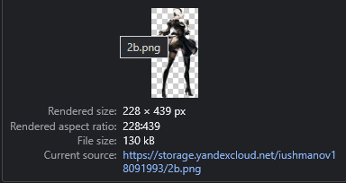

# Домашнее задание к занятию «Вычислительные мощности. Балансировщики нагрузки»  

---
## Задание 1. Yandex Cloud 

**Что нужно сделать**

1. Создать бакет Object Storage и разместить в нём файл с картинкой:

 - Создать бакет в Object Storage с произвольным именем (например, _имя_студента_дата_).
 - Положить в бакет файл с картинкой.
 - Сделать файл доступным из интернета.

 **Ответ**

 [Бакет:](../terraform/storage.tf)

 ```hcl
 resource "yandex_storage_bucket" "bucket-main" {
  access_key = yandex_iam_service_account_static_access_key.bucket-sa-static-key.access_key
  secret_key = yandex_iam_service_account_static_access_key.bucket-sa-static-key.secret_key
  bucket     = "iushmanov18091993"

  anonymous_access_flags {
    read = true
    list = false
  }

  default_storage_class = "STANDARD"

  max_size = 5368709120
} 
 ```

 [Файл:](../terraform/storage.tf)

```hcl
resource "yandex_storage_object" "two-b" {
  access_key = yandex_iam_service_account_static_access_key.bucket-sa-static-key.access_key
  secret_key = yandex_iam_service_account_static_access_key.bucket-sa-static-key.secret_key
  bucket     = "${yandex_storage_bucket.bucket-main.id}"

  key = "2b.png"
  source = "assets/2B_Nier_Automata.png"
  acl = "public-read"
}
```

Доступность из внешней сети:


 
2. Создать группу ВМ в public подсети фиксированного размера с шаблоном LAMP и веб-страницей, содержащей ссылку на картинку из бакета:

 - Создать Instance Group с тремя ВМ и шаблоном LAMP. Для LAMP рекомендуется использовать `image_id = fd827b91d99psvq5fjit`.
 - Для создания стартовой веб-страницы рекомендуется использовать раздел `user_data` в [meta_data](https://cloud.yandex.ru/docs/compute/concepts/vm-metadata).
 - Разместить в стартовой веб-странице шаблонной ВМ ссылку на картинку из бакета.
 - Настроить проверку состояния ВМ.

 **Ответ**

 [Группа (для сетевого балансировщика)](../terraform/vms.tf)

 ```hcl
 resource "yandex_compute_instance_group" "net-balanced-vms" {
  name = "net-balanced-group"
  folder_id = "b1gen0ivt5de5o1t09r6"
  service_account_id  = "${yandex_iam_service_account.ig-sa.id}"
  

  instance_template {

    resources {
      cores  = 2
      memory = 2
      core_fraction = 5
    }

    network_interface {
      network_id = yandex_vpc_network.main.id
      subnet_ids = ["${yandex_vpc_subnet.public.id}"]
    }

    scheduling_policy {
      preemptible = true
    }

    metadata = {
      ssh-keys = "ubuntu:${file("~/.ssh/id_rsa.pub")}"
      user-data = "${templatefile(
          "http-server-bootstrap.sh.tftpl", 
          { 
            bucket = "${yandex_storage_object.two-b.bucket}", 
            file = "${yandex_storage_object.two-b.key}" 
          }
        )
      }"
    }

    boot_disk {
      initialize_params {
        image_id = "fd88asm0l117f4gl6nkl"
      }
    }
  }

  scale_policy {
    fixed_scale {
      size = 3
    }
  }

  deploy_policy {
    max_unavailable = 1
    max_expansion   = 0
  }

  allocation_policy {
    zones = ["ru-central1-a"]
  }

  health_check {
    http_options {
      port = 80
      path = "/"
    }
    timeout = 10
    unhealthy_threshold = 2
    interval = 30

  }

  load_balancer {
    target_group_name = "net-balanced-vms"
  }  
}
 ```

Шаблон init-скрипта, заполняемый с помощью `templatefile`:

 ```shell
 #!/bin/bash

set -e

sudo apt update
sudo apt install -y apache2
service apache2 start
cd /var/www/html
echo "<html><h1>WELCOME TO SERVER! Look at 2b:</h1></html>
" > index.html
 ```

Проверка состояния машин:

 
 
3. Подключить группу к сетевому балансировщику:

 - Создать сетевой балансировщик.
 - Проверить работоспособность, удалив одну или несколько ВМ.

**Ответ**

[Балансировщик:](../terraform/network.tf)

```hcl
resource "yandex_lb_network_load_balancer" "lb-1" {
  name = "network-load-balancer-1"

  listener {
    name = "network-load-balancer-1-listener"
    port = 80
    external_address_spec {
      ip_version = "ipv4"
    }
  }

  attached_target_group {
    target_group_id = yandex_compute_instance_group.net-balanced-vms.load_balancer.0.target_group_id

    healthcheck {
      name = "http"
      http_options {
        port = 80
        path = "/index.html"
      }
    }
  }
}
```

Страница загружается:


4. (дополнительно)* Создать Application Load Balancer с использованием Instance group и проверкой состояния.

[Манифесты ресурсов:](../terraform/network.tf)

```hcl
resource "yandex_alb_backend_group" "l7-backend-group" {
  name = "my-backend"

  http_backend {
    name = "http-back"
    port = 80
    weight = 1 
    target_group_ids = [ "${yandex_compute_instance_group.balanced-vms.application_load_balancer.0.target_group_id}" ]
  
    load_balancing_config {
      panic_threshold = 50
    }    
    healthcheck {
      timeout = "1s"
      interval = "1s"
      http_healthcheck {
        path  = "/"
      }
    }
    http2 = "false"  
  }
}

resource "yandex_alb_http_router" "tf-router" {
  name   = "http-router"
}

resource "yandex_alb_virtual_host" "my-virtual-host" {
  name           = "virtual-host"
  http_router_id = yandex_alb_http_router.tf-router.id
  route {
    name = "default"
    http_route {
      http_route_action {
        backend_group_id = yandex_alb_backend_group.l7-backend-group.id
        timeout          = "60s"
      }
    }
  }
} 

resource "yandex_alb_load_balancer" "l7-balancer" {

  name = "l7-balancer"
  network_id = yandex_vpc_network.main.id

  allocation_policy {
    location {
      zone_id   = "ru-central1-a"
      subnet_id = yandex_vpc_subnet.public.id
    }
  }

  listener {
    name = "l7-balancer-listener"
    endpoint {
      address {
        external_ipv4_address {          
        }
      }
      ports = [ 80, 443 ]
    }
    http {
      handler {
        http_router_id = yandex_alb_http_router.tf-router.id
      }
    }
  }  
}
```

Страница:


Проверки состояния:


Логи доступа к бэкендам:


