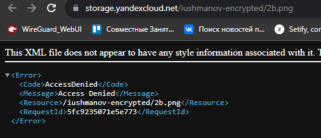
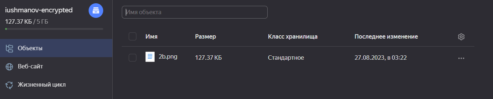
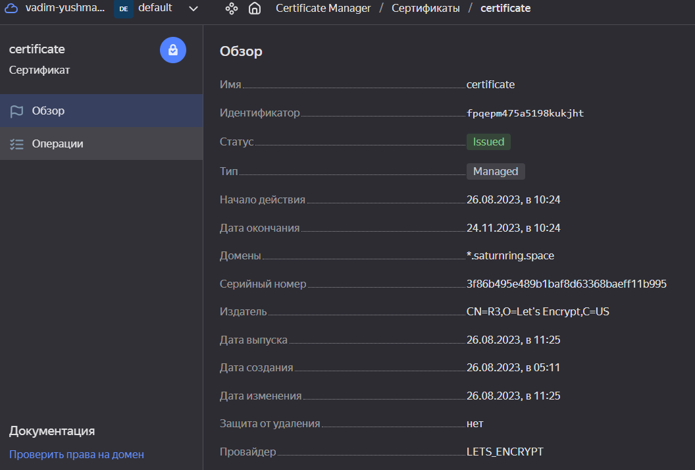
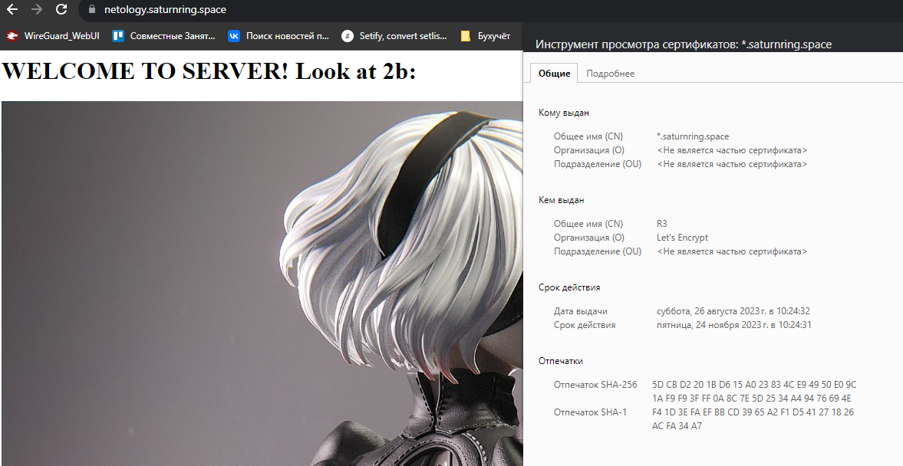

# Домашнее задание к занятию «Безопасность в облачных провайдерах»  

## Задание 1. Yandex Cloud   

1. С помощью ключа в KMS необходимо зашифровать содержимое бакета:

 - создать ключ в KMS;
 - с помощью ключа зашифровать содержимое бакета, созданного ранее.

### Ответ

**Примечание:** зашифрованное хранилище невозможно сделать публичным (то ли это баг Яндекс Клауда, то ли так и задумано). Вернее, сделать можно, но ни один файл открываться не будет. 



По этой причине, хранилище было сделано закрытым, для статического сайта было создано отдельное, без шифрования.

Файл можно скачать с аутентификацией или по ссылке, сгенерированной в админ-консоли.

**Манифест**

```hcl
resource "yandex_kms_symmetric_key" "key-a" {
  name              = "encryption-key"
  description       = "for storage"
  default_algorithm = "AES_128"
  rotation_period   = "8760h" // equal to 1 year
}

resource "yandex_storage_bucket" "bucket-main" {
  access_key = yandex_iam_service_account_static_access_key.bucket-sa-static-key.access_key
  secret_key = yandex_iam_service_account_static_access_key.bucket-sa-static-key.secret_key
  bucket     = "iushmanov-encrypted"
  folder_id = local.folder_id

  anonymous_access_flags {
    read = false
    list = false
  }

  server_side_encryption_configuration {
    rule {
      apply_server_side_encryption_by_default {
        kms_master_key_id = yandex_kms_symmetric_key.key-a.id
        sse_algorithm     = "aws:kms"
      }
    }
  }

  default_storage_class = "STANDARD"

  max_size = 5368709120

}

resource "yandex_storage_object" "twob" {
  access_key = yandex_iam_service_account_static_access_key.bucket-sa-static-key.access_key
  secret_key = yandex_iam_service_account_static_access_key.bucket-sa-static-key.secret_key
  bucket     = yandex_storage_bucket.bucket-main.id

  key = "2b.png"
  source = "assets/2B_Nier_Automata.png"
  acl = "public-read"
}
```

**Файл в консоли:**



2. Создать статический сайт в Object Storage c собственным публичным адресом и сделать доступным по HTTPS:

 - создать сертификат;
 - создать статическую страницу в Object Storage и применить сертификат HTTPS;
 - в качестве результата предоставить скриншот на страницу с сертификатом в заголовке (замочек).

### Ответ

**Сертификат:**



**Манифест:**

```hcl
resource "yandex_storage_bucket" "static-site" {
  access_key = yandex_iam_service_account_static_access_key.bucket-sa-static-key.access_key
  secret_key = yandex_iam_service_account_static_access_key.bucket-sa-static-key.secret_key
  bucket     = "netology.saturnring.space"
  folder_id = local.folder_id

  anonymous_access_flags {
    read = true
    list = false
  }

  https {
    certificate_id = local.cert_id
  }

  website {
    index_document = "index.html"
    error_document = "error.html"
  }

  default_storage_class = "STANDARD"

  max_size = 5368709120

}

resource "yandex_storage_object" "index" {
  access_key = yandex_iam_service_account_static_access_key.bucket-sa-static-key.access_key
  secret_key = yandex_iam_service_account_static_access_key.bucket-sa-static-key.secret_key
  bucket     = yandex_storage_bucket.static-site.id

  key = "index.html"
  source = "assets/index.html"
  acl = "public-read"
}

resource "yandex_storage_object" "error" {
  access_key = yandex_iam_service_account_static_access_key.bucket-sa-static-key.access_key
  secret_key = yandex_iam_service_account_static_access_key.bucket-sa-static-key.secret_key
  bucket     = yandex_storage_bucket.static-site.id

  key = "error.html"
  source = "assets/error.html"
  acl = "public-read"
}

resource "yandex_dns_zone" "dns" {

  name = "netology"
  zone = "netology.saturnring.space."
  public = true
  
}

resource "yandex_dns_recordset" "aname" {
  zone_id = yandex_dns_zone.dns.id
  name = "@"
  type = "ANAME"
  ttl = 600
  data = [ "netology.saturnring.space.website.yandexcloud.net" ]

}
```

**Сайт:**

