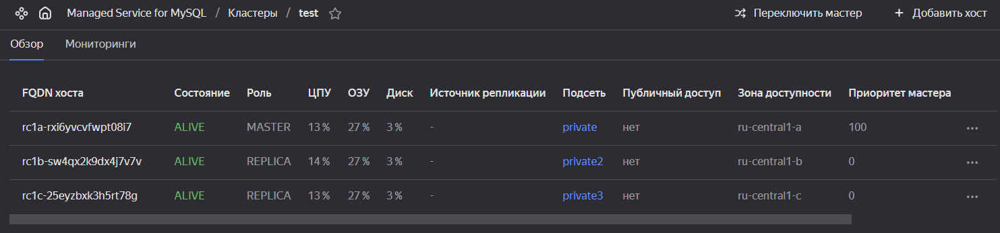
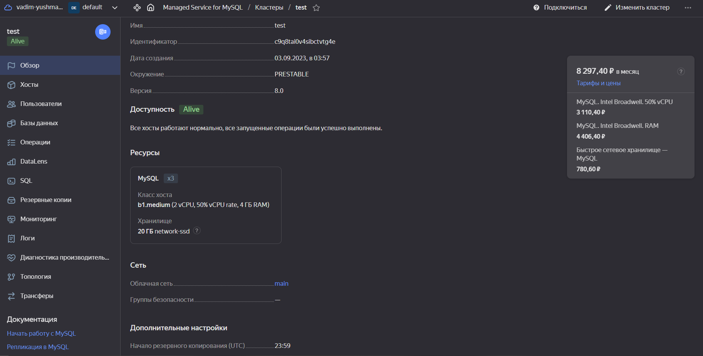
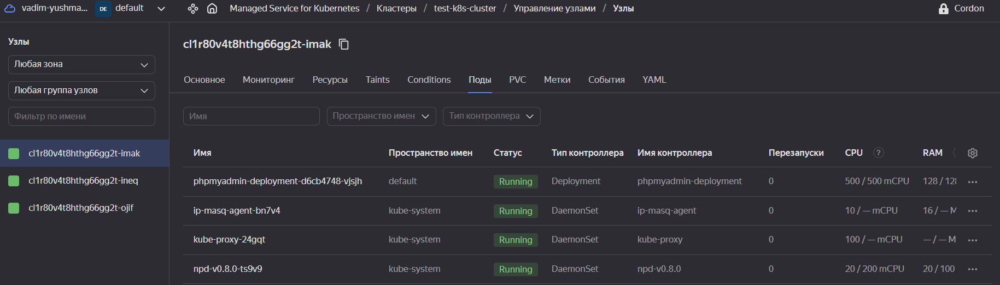
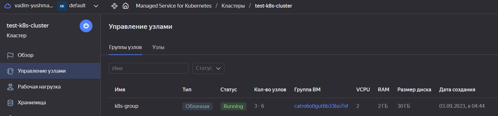
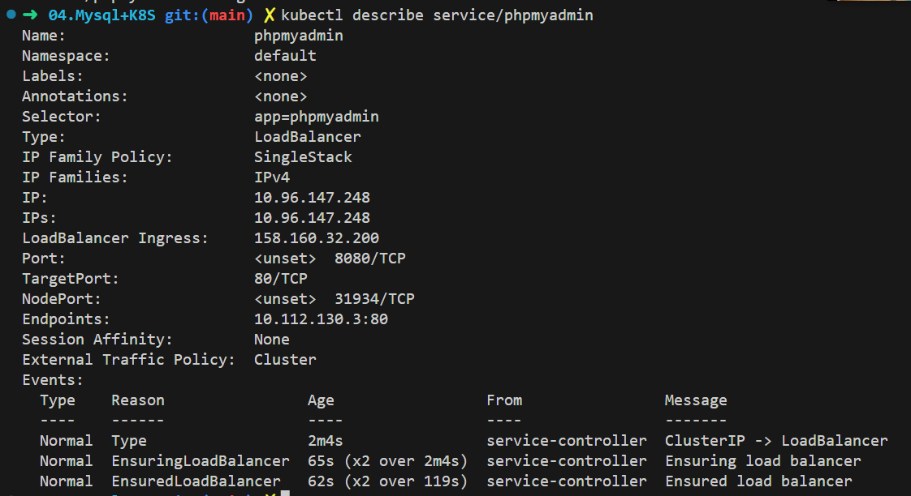
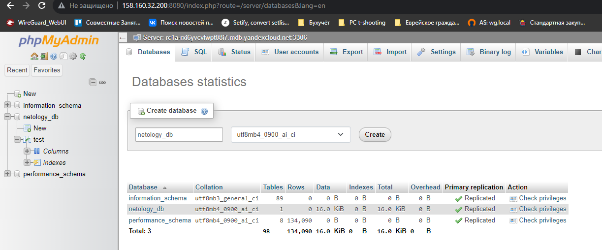

# Домашнее задание к занятию «Кластеры. Ресурсы под управлением облачных провайдеров»

### Цели задания 

1. Организация кластера Kubernetes и кластера баз данных MySQL в отказоустойчивой архитектуре.
2. Размещение в private подсетях кластера БД, а в public — кластера Kubernetes.

---
## Задание 1. Yandex Cloud

[Terraform files](../terraform)

[phpMyAdmin manifest](phpmyadmin.yml)


1. Настроить с помощью Terraform кластер баз данных MySQL.

 - Используя настройки VPC из предыдущих домашних заданий, добавить дополнительно подсеть private в разных зонах, чтобы обеспечить отказоустойчивость. 
 - Разместить ноды кластера MySQL в разных подсетях.
 - Необходимо предусмотреть репликацию с произвольным временем технического обслуживания.
 - Использовать окружение Prestable, платформу Intel Broadwell с производительностью 50% CPU и размером диска 20 Гб.
 - Задать время начала резервного копирования — 23:59.
 - Включить защиту кластера от непреднамеренного удаления.
 - Создать БД с именем `netology_db`, логином и паролем.

 ```hcl
 resource "yandex_mdb_mysql_cluster" "mysql-cluster" {
  name        = "test"
  environment = "PRESTABLE"
  network_id  = yandex_vpc_network.main.id
  version     = "8.0"

  host {
    zone      = "ru-central1-a"
    subnet_id = yandex_vpc_subnet.private.id
    priority = 100
  }

  host {
    zone      = "ru-central1-b"
    subnet_id = yandex_vpc_subnet.private2.id
  }

  host {
    zone      = "ru-central1-c"
    subnet_id = yandex_vpc_subnet.private3.id
  }

  resources {
    resource_preset_id = "b1.medium"
    disk_type_id       = "network-ssd"
    disk_size          = 20
  }

  maintenance_window {
    type = "ANYTIME"
  }

  backup_window_start {
    hours = 23
    minutes = 59
  }

  deletion_protection = true
  
}

resource "yandex_mdb_mysql_database" "netology-db" {
    cluster_id = yandex_mdb_mysql_cluster.mysql-cluster.id
    name = "netology_db"
}

resource "yandex_mdb_mysql_user" "the-user" {
    cluster_id = yandex_mdb_mysql_cluster.mysql-cluster.id
    name       = "user"
    password   = "netology"

    permission {
      database_name = yandex_mdb_mysql_database.netology-db.name
      roles         = ["ALL"]
    }

    connection_limits {
      max_questions_per_hour   = 1000
      max_updates_per_hour     = 200
      max_connections_per_hour = 300
      max_user_connections     = 400
    }

    authentication_plugin = "MYSQL_NATIVE_PASSWORD"
}

output "fqdn" {
  value = yandex_mdb_mysql_cluster.mysql-cluster.host.*.fqdn[0]
}
 ```






2. Настроить с помощью Terraform кластер Kubernetes.

 - Используя настройки VPC из предыдущих домашних заданий, добавить дополнительно две подсети public в разных зонах, чтобы обеспечить отказоустойчивость.
 - Создать отдельный сервис-аккаунт с необходимыми правами. 
 - Создать региональный мастер Kubernetes с размещением нод в трёх разных подсетях.
 - Добавить возможность шифрования ключом из KMS, созданным в предыдущем домашнем задании.
 - Создать группу узлов, состояющую из трёх машин с автомасштабированием до шести.
 - Подключиться к кластеру с помощью `kubectl`.
 - *Запустить микросервис phpmyadmin и подключиться к ранее созданной БД.
 - *Создать сервис-типы Load Balancer и подключиться к phpmyadmin. Предоставить скриншот с публичным адресом и подключением к БД.

 ```hcl
 resource "yandex_iam_service_account" "k8s-sa" {
 name        = "k8s-sa"
 description = "Service account for Kubernetes cluster"
}

resource "yandex_resourcemanager_folder_iam_member" "editor" {
 folder_id = local.folder_id
 role      = "editor"
 member    = "serviceAccount:${yandex_iam_service_account.k8s-sa.id}"
}

resource "yandex_resourcemanager_folder_iam_member" "images-puller" {
 folder_id = local.folder_id
 role      = "container-registry.images.puller"
 member    = "serviceAccount:${yandex_iam_service_account.k8s-sa.id}"
}

resource "yandex_resourcemanager_folder_iam_member" "public-admin" {
 folder_id = local.folder_id
 role      = "vpc.publicAdmin"
 member    = "serviceAccount:${yandex_iam_service_account.k8s-sa.id}"
}

resource "yandex_kubernetes_cluster" "k8s-regional" {

  name = "test-k8s-cluster"

  network_id = yandex_vpc_network.main.id
  

  master {
    version = 1.25
    public_ip = true
    regional {
      region = "ru-central1"
      location {
        zone      = yandex_vpc_subnet.public.zone
        subnet_id = yandex_vpc_subnet.public.id
      }
      location {
        zone      = yandex_vpc_subnet.public2.zone
        subnet_id = yandex_vpc_subnet.public2.id
      }
      location {
        zone      = yandex_vpc_subnet.public3.zone
        subnet_id = yandex_vpc_subnet.public3.id
      }
    }
  }

  service_account_id      = yandex_iam_service_account.k8s-sa.id
  node_service_account_id = yandex_iam_service_account.k8s-sa.id

  depends_on = [
    yandex_resourcemanager_folder_iam_member.editor,
    yandex_resourcemanager_folder_iam_member.images-puller,
    yandex_resourcemanager_folder_iam_member.public-admin
  ]
  kms_provider {
    key_id = yandex_kms_symmetric_key.key-a.id
  }
}

resource "yandex_kubernetes_node_group" "my_node_group" {
  cluster_id  = yandex_kubernetes_cluster.k8s-regional.id
  name        = "k8s-group"
  description = "description"
  version     = "1.25"

  instance_template {
    platform_id = "standard-v1"

    network_interface {
      nat                = true
      subnet_ids         = [
        "${yandex_vpc_subnet.public.id}"
      ]
    }

    resources {
      memory = 2
      cores  = 2
      core_fraction = 5
    }

    boot_disk {
      type = "network-hdd"
      size = 30
    }

    scheduling_policy {
      preemptible = true
    }

    container_runtime {
      type = "containerd"
    }
  }

  scale_policy {
    auto_scale {
      min = 3
      initial = 3
      max = 6
    }
  }

  allocation_policy {
    location {
      zone = "ru-central1-a"
    }

  }  
}
 ```





```yml
apiVersion: apps/v1
kind: Deployment
metadata:
  name: phpmyadmin-deployment
  labels:
    app: phpmyadmin
spec:
  replicas: 1
  selector:
    matchLabels:
      app: phpmyadmin
  template:
    metadata:
      labels:
        app: phpmyadmin
    spec:
      containers:
        - name: phpmyadmin
          image: phpmyadmin/phpmyadmin
          resources:
            limits:
              memory: "128Mi"
              cpu: "500m"
          ports:
            - containerPort: 80
          env:
            - name: PMA_HOST
              value: rc1a-rxi6yvcvfwpt08i7.mdb.yandexcloud.net
            - name: PMA_PORT
              value: "3306"
            - name: MYSQL_ROOT_PASSWORD
              value: netology

---
apiVersion: v1
kind: Service
metadata:
  name: phpmyadmin
spec:
  selector:
    app: phpmyadmin
  ports:
  - port: 8080
    targetPort: 80
  type: LoadBalancer
```





