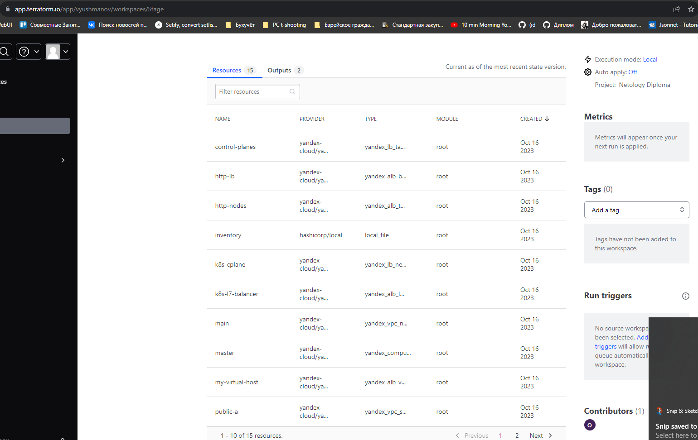
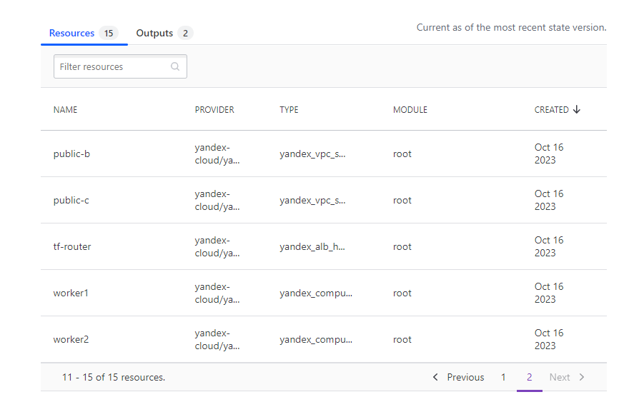
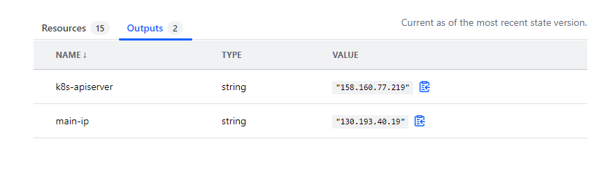
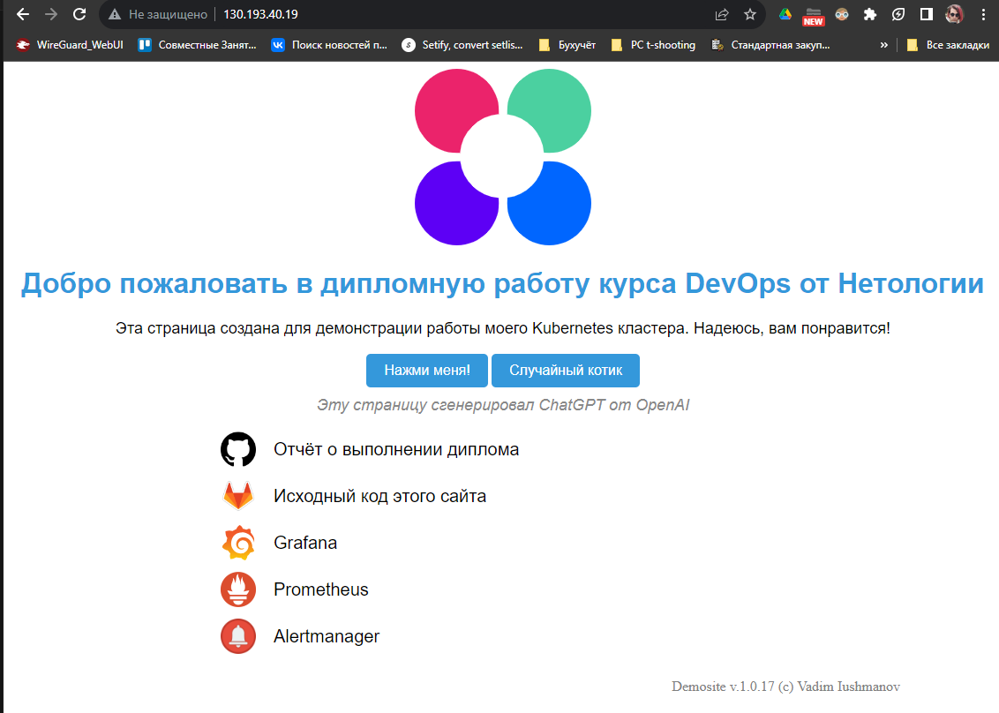
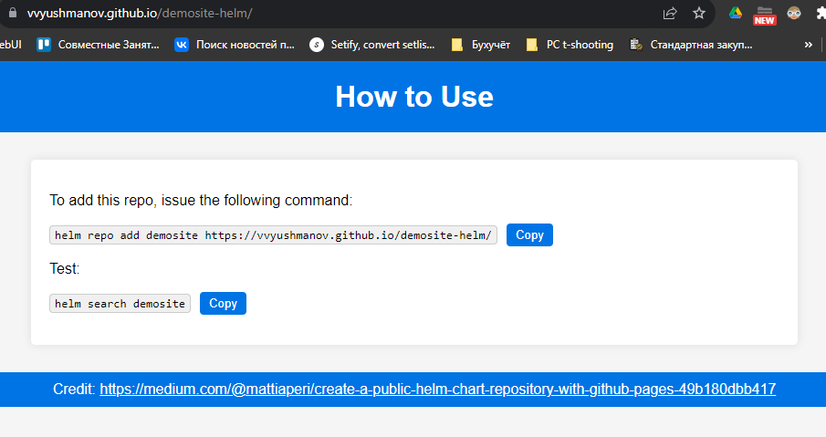

# Дипломный практикум по специальности DevOps-инженер

## Цели

1. Подготовить облачную инфраструктуру на базе облачного провайдера Яндекс.Облако.
2. Запустить и сконфигурировать Kubernetes кластер.
3. Установить и настроить систему мониторинга.
4. Настроить и автоматизировать сборку тестового приложения с использованием Docker-контейнеров.
5. Настроить CI для автоматической сборки и тестирования.
6. Настроить CD для автоматического развёртывания приложения.

## Инфраструктура

### Terraform

1. Репозиторий с конфигурациями `Terraform`:

[Репозиторий](./10-terraform)

2. Ресурсы в Terraform Cloud:







Терраформ по результатам работы генерирует файл hosts.yaml по шаблону [hosts.yml.tftpl](./10-terraform/hosts.yml.tftpl).
Ноды 4-6 создаются опционально, в зависиомсти от того, были ли они созданы, это достигается благодаря использовании функции try() в tf манифесте и функции if в шаблоне.

```hcl
resource "local_file" "inventory" {
  filename = "hosts.yml"
  content = templatefile("hosts.yml.tftpl",
    {
        node1-nat-ip = local.node1-nat-ip,
        node1-local-ip = local.node1-ip,
        node2-nat-ip = local.node2-nat-ip,
        node2-local-ip = local.node2-ip,
        node3-nat-ip = local.node3-nat-ip,
        node3-local-ip = local.node3-ip,
        node4-nat-ip = local.node4-nat-ip,
        node4-local-ip = local.node4-ip,
        node5-nat-ip = local.node5-nat-ip,
        node5-local-ip = local.node5-ip,
        node6-nat-ip = local.node6-nat-ip,
        node6-local-ip = local.node6-ip,

        lb-ip = local.lb-ip
    }
  )
}
```

Помимо прочего, в инфраструктуре установлен Network балансировщик для ApiServer и L7 балансировщик для HTTP трафика.

Конфигурация содержится в файле [load-balancer.tf](./10-terraform/load-balancer.tf)

### Ansible playbook (Kubespray)

1. [Репозиторий](./20-kubespray/)

Для расширения кластера используется скрипт [scale.sh](./scale.sh)

### Приложение (web-страница)

1. [Исходный код приложения](https://gitlab.com/vvyushmanov/demosite)

Для хранения был выбран GitLab для возможности использования Gitlab CI

2. [Собранные образы в DockerHub](https://hub.docker.com/r/vyushmanov/demosite/tags)

3. Главная страница:



### Конфигурация компонентов кластера (qbec)

1. [Репозиторий](./30-k8s/)

Конфигурация состоит из 3 компонентов:

* `kube-prometheus` (мониторинг стек)
* `gitlab-agent` (интеграция кластера с Gitlab CI)
* `demosite` (основное приложение)

Основное приложение развертывается посредством qbec в составе кластера, далее управляется с помощью helm.

## Деплой инфраструктуры

Для деплоя можно использовать скрипт [deploy.sh](./deploy.sh).
Выполнение скрипта предполагает, что на локальной машине установлен и настроен:

* Terraform и сервис-аккаунт YC для него
* Ansible и прочие зависимости kubespray
* kubectl
* qbec
* helm

```shell
#!/bin/bash

set -e
root=$(pwd)

### Terraform ###
cd $root/10-terraform
# Создаём сети, чтобы обращаться к ним с помощью data source 
terraform apply -target=yandex_vpc_subnet.public-a \
     -target=yandex_vpc_subnet.public-b \
     -target=yandex_vpc_subnet.public-c -auto-approve
# Применяем конфиг и разворачиваем ресурсы
terraform apply -auto-approve
# Копируем сгенерированный Terraform'ом с помощью templatefile() инвентарь 
cp ./hosts.yml $root/20-kubespray/inventory/diploma/
# Сохраняем IP адрес L7-балансировщика в переменную
mainIP=$(terraform output -raw main-ip)

echo "========================================="

### Kubespray ###
cd $root/20-kubespray
# Применяем конфигурацию ansible-playbook
ansible-playbook -i inventory/diploma/hosts.yml cluster.yml -b -v --user=ubuntu
# В ansible настроено копирование конфига на controlling хост. Копируем его в папку конфигурации по умолчанию.
echo "Copy new KubeConfig file to ~/.kube/config"
cp ./inventory/diploma/artifacts/admin.conf $HOME/.kube/config
# Ожидаем готовности всех системных компонентов кластера
echo "Wait for all kube-system components to be up"
kubectl wait --for=condition=Ready pod -n kube-system --all --timeout=900s

echo "========================================="

### Qbec ###
# Обновляем IP адрес сервера из конфига 
cd $root/30-k8s
server_line=$(grep 'server:' $HOME/.kube/config)
ip_address=$(echo "$server_line" | awk -F '//' '{print $2}' | cut -d ':' -f 1)
sed -i "s/server: https:\/\/[0-9.]*:6443/server: https:\/\/$ip_address:6443/" ./qbec.yaml
echo "qbec ApiServer IP address set to: $ip_address"
# Применяем конфигурацию с автоподтверждением и ожиданием готовности всех компонентов
qbec apply default --yes --wait

### Вывод результатов в консоль ###
echo "Congrats! Cluster is fully operational"
echo "Open main page: http://$mainIP/"
echo "Grafana: http://$mainIP/grafana/"

```

## Обновление основного приложения

### В автоматическом режиме

Обновление осуществляется путём комита с тэгом, сборка и деплой осуществляются с помощью Gitlab CI

1. Обновление

```shell
git add .
git commit -m "some new features"
git tag "1.1.0"
git push --tags
```

2. [Пайплайн](https://gitlab.com/vvyushmanov/demosite/-/blob/main/.gitlab-ci.yml)

```yaml
default:
  image: docker:24.0.5
  services:
    - docker:24.0.5-dind    

build-dev:
  stage: build
  before_script:
    - docker login -u $DOCKER_USER -p $DOCKER_PASSWORD
  script:
    - docker build --no-cache -t vyushmanov/demosite:$CI_COMMIT_SHORT_SHA .
    - docker push vyushmanov/demosite:$CI_COMMIT_SHORT_SHA
  rules:
    - if: $CI_COMMIT_TAG == null

build-version:
  stage: build
  before_script:
    - docker login -u $DOCKER_USER -p $DOCKER_PASSWORD
  script:
    - docker build --no-cache --pull -t vyushmanov/demosite:$CI_COMMIT_TAG .
    - docker build --no-cache -t vyushmanov/demosite:latest .
    - docker push vyushmanov/demosite:$CI_COMMIT_TAG
    - docker push vyushmanov/demosite:latest
  rules:
    - if: $CI_COMMIT_TAG =~ /[0-9]+\.[0-9]+\.[0-9]+/

deploy-k8s:
  stage: deploy
  image:
    name: dtzar/helm-kubectl:latest
    entrypoint: ['']
  script:
    - kubectl config get-contexts
    - kubectl config use-context vvyushmanov/demosite:demosite-k8s
    - ./helmify.sh # <- простановка Helm лейблов и аннотаций в случае их отсутствия 
    - helm upgrade demosite demosite --repo https://vvyushmanov.github.io/demosite-helm/ --install --set appVersion=$CI_COMMIT_TAG
    - kubectl wait --for=condition=Ready pod -l app=demosite --timeout=60s
    - kubectl get pods
  rules:
    - if: $CI_COMMIT_TAG =~ /[0-9]+\.[0-9]+\.[0-9]+/
```

Для получения доступа к кластеру используется интеграция через https://docs.gitlab.com/ee/user/clusters/agent/ci_cd_workflow.html .
Конфигурация Gitlab Agent разворачивается при первичной настройке кластера с помощью [qbec](./30-k8s/qbec.yaml)

### Ручное обновление

Репозиторий c исходниками Helm чартов находится [на GitHub](https://github.com/vvyushmanov/demosite-helm)

Устанавливаемый Helm репозиторий расположен на [GitHub Pages](https://vvyushmanov.github.io/demosite-helm/):



```shell
helm upgrade demosite demosite --repo https://vvyushmanov.github.io/demosite-helm/ --install --set appVersion="1.0.18"
kubectl wait --for=condition=Ready pod -l app=demosite --timeout=60s
